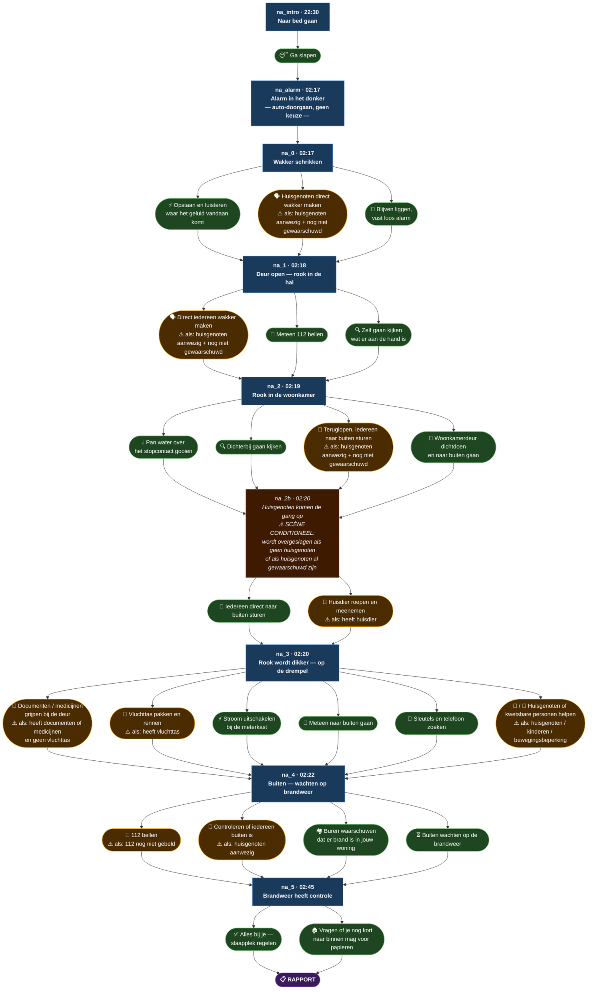

# Keuze-boom — Nachtalarm scenario

**Scenario:** "De rookmelder gaat af in de nacht"
**Tijdspanne:** 22:30 (maandag) → 02:45 (dinsdag)
**Scenes:** na_intro → na_alarm → na_0 → na_1 → na_2 → na_2b → na_3 → na_4 → na_5 → rapport

## Legenda

| Stijl | Betekenis |
|---|---|
| Blauw rechthoek | Scene |
| Groen afgerond | Gewone keuze — altijd zichtbaar |
| Oranje afgerond | Conditionele keuze — ⚠️ alleen voor bepaald profiel |
| Rood/oranje scene | Conditionele scène — ⚠️ kan volledig worden overgeslagen |
| Paars | Rapport (eindpunt) |

> Alle keuzes in een scene leiden altijd naar dezelfde volgende scene.
> De keuze bepaalt het verhaal, niet de route.

